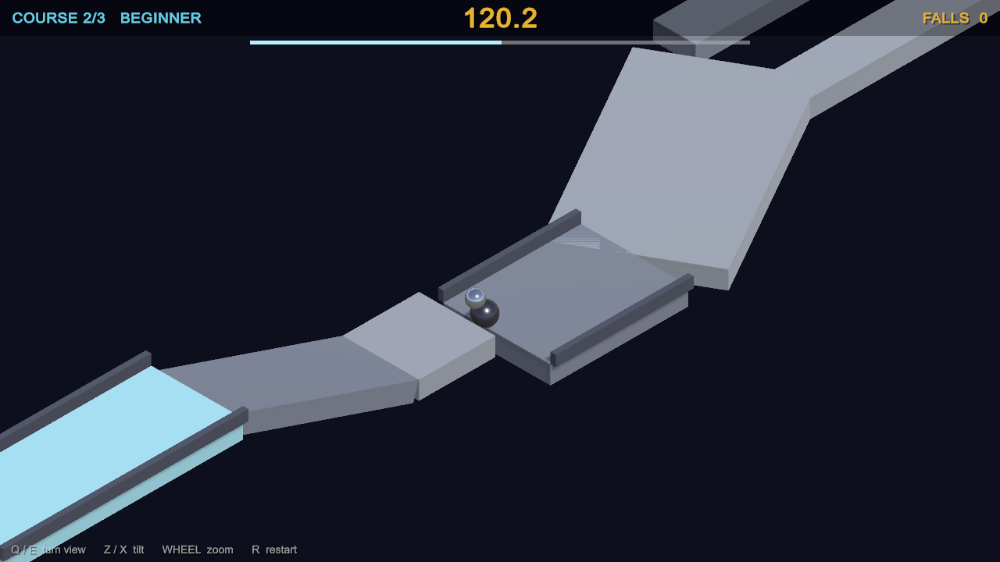

# Rolling Steel

An isometric roll-a-marble-downhill game for macOS, built in Unity 6.3 — three
descending courses, one shared clock, and a marble that only ever moves because
you pushed it.

In the spirit of the 1984 Atari cabinet: no jump button, no brakes, just
momentum, friction and whatever the slope decides to do to you.


## Quick start

```bash
git clone https://github.com/geekychris/rolling_steel.git
cd rolling_steel
make run          # builds the player, then launches it
```

Requires macOS and **Unity 6000.6.3f1** with the macOS Build Support module.
See [docs/BUILDING.md](docs/BUILDING.md) for prerequisites, other Unity versions,
and what to do when the editor holds the project lock.

## Controls

| Key | Action |
|-----|--------|
| `WASD` / arrow keys | push the marble |
| `Q` / `E` | turn the view — tap for a 45° step, hold to spin freely |
| `Z` / `X` | tilt the camera |
| mouse wheel, `-` / `=` | zoom |
| `Space` / `Return` | start |
| `R` | restart the run |
| `Esc` | quit |

Steering is **camera-relative**: "push up" always means "away from the camera",
so turning the view turns the controls with it.

## The courses

| # | Name | Clock | What it throws at you |
|---|------|-------|----------------------|
| 1 | Practice | 75 s | wide and kerbed, one pit, one steel marble |
| 2 | Beginner | +70 s | ice, an acid pond, a gap to jump, two chasers |
| 3 | Intermediate | +65 s | exposed catwalks, a steep ice drop, an acid slalom, sand at the worst moment |

Time **carries over** between courses and never stops. Falling costs 3 seconds
and puts you back on the course just behind where you last had contact. Running
the clock to zero ends the run — the clock is the lives system.

| | |
|---|---|
|  |  |

## Hazards

- **Acid ponds** — green, flush with the deck, instantly fatal.
- **Green blobs** — glide back and forth across the deck; contact is fatal.
- **Steel marbles** — heavier than you, roll at you when you get close, and
  shoulder you off the edge. Not fatal on their own; the drop is.
- **Ice** — nearly frictionless. **Sand** — kills your speed right before you need it.

## Make targets

| Target | Does |
|--------|------|
| `make build` | build the macOS player into `Builds/RollingSteel.app` |
| `make run` | build if needed, then launch windowed |
| `make verify` | headless: the game plays itself and asserts all three courses are completable |
| `make shots` | capture in-engine screenshots into `shots/` |
| `make setup` | regenerate materials, the scene and player settings |
| `make clean` | remove build output and Unity caches |

## Docs

- [Building](docs/BUILDING.md) — prerequisites, scripts, troubleshooting
- [Architecture](docs/ARCHITECTURE.md) — how the code fits together and why it is built at runtime
- [Course design](docs/COURSE-DESIGN.md) — the `CourseBuilder` DSL, and how to write your own course
- [Verification](docs/VERIFICATION.md) — the self-playing bot, and two physics traps it caught

## Notable design choice

The project contains **exactly one authored asset**: an otherwise empty scene
holding a single `GameDirector` component. All geometry, materials, lighting,
camera, HUD and audio are generated at runtime or by an editor script, so the
entire game regenerates from source with no manual editor work. See
[docs/ARCHITECTURE.md](docs/ARCHITECTURE.md).

## Licence

MIT — see [LICENSE](LICENSE).
