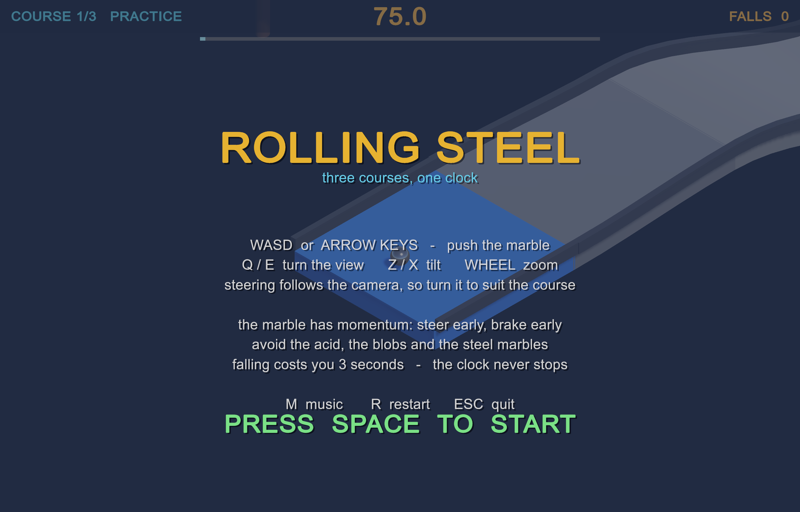
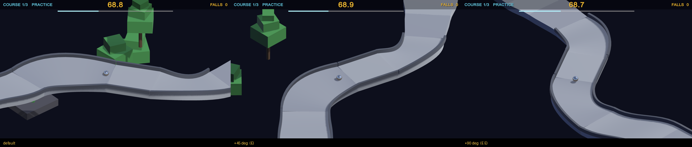
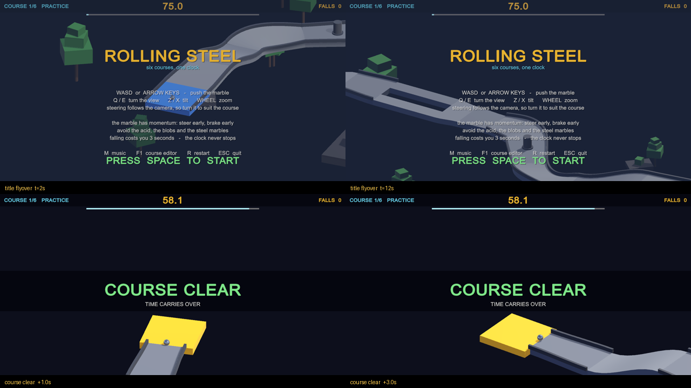
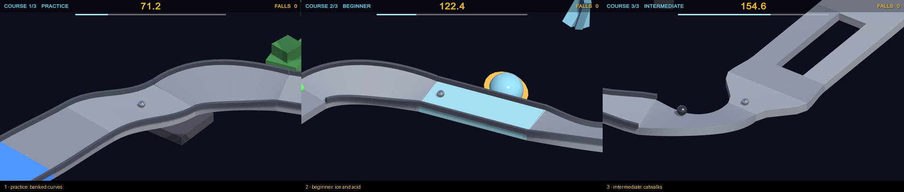
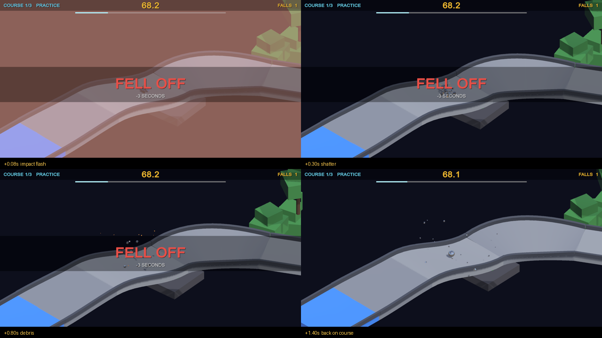
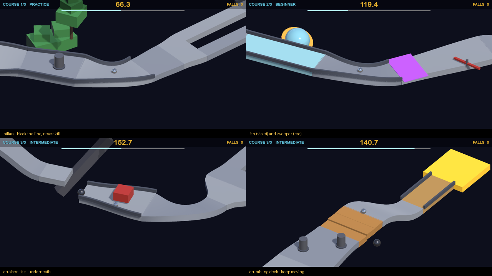
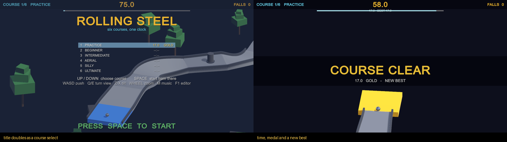
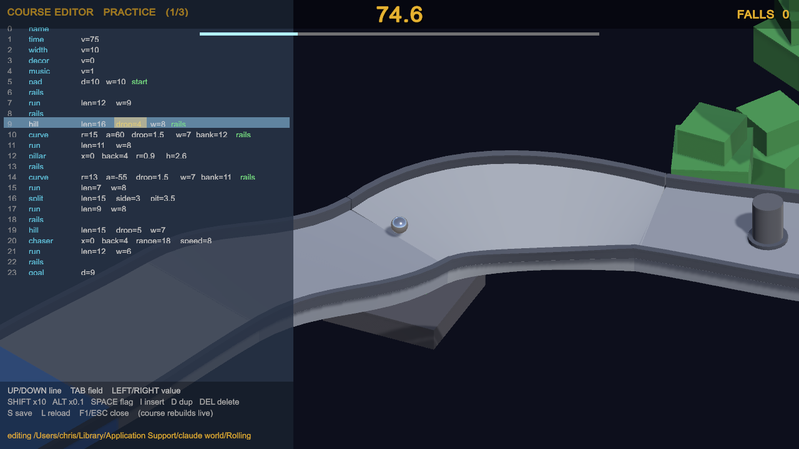
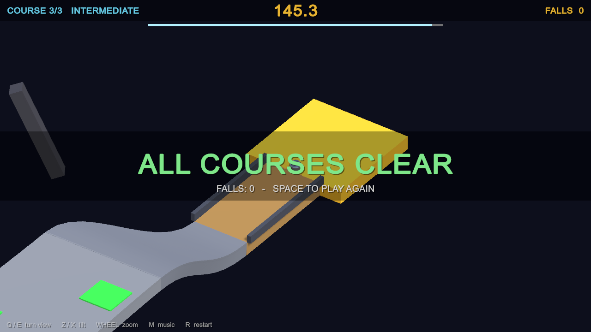

# Rolling Steel

An isometric roll-a-marble-downhill game for macOS, built in Unity 6.3 — six
descending courses, one shared clock, and a marble that only ever moves because
you pushed it.

In the spirit of the 1984 Atari cabinet: no jump button, no brakes, just
momentum, friction and whatever the slope decides to do to you. Chunky slab
decks where the drop needs to read clearly, banked curves and eased ramps where
the course should flow, abstract scenery drifting in the void, and a synthesised
soundtrack that is generated at startup rather than loaded.



## Quick start

```bash
git clone https://github.com/geekychris/rolling_steel.git
cd rolling_steel
make run          # builds the player, then launches it
```

Requires macOS and **Unity 6000.6.3f1** with the macOS Build Support module.
See [docs/BUILDING.md](docs/BUILDING.md) for prerequisites, other Unity versions,
and what to do when the editor holds the project lock.

## Controls

| Key | Action |
|-----|--------|
| `WASD` / arrow keys | push the marble |
| `Q` / `E` | turn the view — tap for a 45° step, hold to spin freely |
| `Z` / `X` | tilt the camera |
| mouse wheel, `-` / `=` | zoom |
| `M` | music on / off |
| `Up` / `Down` on the title | choose which course to start from |
| `F1` | open the course editor |
| `Space` / `Return` | start |
| `R` | restart the run |
| `Esc` | quit |

Steering is **camera-relative**: "push up" always means "away from the camera",
so turning the view turns the controls with it — which is what makes a freely
rotatable camera workable in a game that is otherwise all momentum.



When nobody is driving, the camera goes on a slow helicopter orbit by itself: a
travelling flyover of the course behind the title card, and a circle of the
finish pad when a course is cleared.



## The courses

Six, each with its own scenery theme and its own synthesised track.

| # | Name | Clock | What it throws at you |
|---|------|-------|----------------------|
| 1 | Practice | 75 s | wide and kerbed, one pit, a pillar, one steel marble |
| 2 | Beginner | +70 s | ice, acid, a jump, a fan, an edge-pivoted sweeper |
| 3 | Intermediate | +65 s | exposed catwalks, a steep ice drop, a crusher, an acid slalom, sand |
| 4 | Aerial | +60 s | long spans with nothing either side, three jumps, very little kerbing |
| 5 | Silly | +58 s | everything moves — paired crushers, fans blowing both ways, a fast sweeper |
| 6 | Ultimate | +56 s | all of it, with the clock at its meanest |

Time **carries over** between courses and never stops. Falling costs 3 seconds
and puts you back on the course just behind where you last had contact. Running
the clock to zero ends the run — the clock is the lives system.



## Track

Two kinds of geometry, mixed deliberately:

- **Slabs** — chunky boxes. They read well isometrically and make a drop legible.
- **Swept ribbons** — banked curves and eased hills, generated as meshes. A `Hill`
  is flat at the top, steepest in the middle and flat again at the bottom, so it
  meets level deck without a crease; a `Curve` banks into the turn and out again.

Pieces link smoothly rather than merely abutting: widths ease across a piece
instead of stepping at its first cross-section, banks and gradients arrive and
leave at zero, and every piece is grown fractionally at each end so it buries
itself in its neighbour instead of leaving a hairline where the faces meet.

## Scenery

Each course gets a dozen pieces of abstract floating scenery on its own theme —
a grove, frost, embers, arches, balloons, monoliths — placed off to the sides so
they frame the void without getting in the way. It is seeded, so a course looks
the same every run, and none of it has a collider.

## Music

Seven themes — a title track and one per course — all synthesised at startup from
a step sequencer: a square-wave bass, a 16th-note arpeggio, a two-operator FM
lead and noise percussion, in the register early-80s arcade hardware worked in.
No audio files anywhere in the repo. `M` toggles it.

| Course | Key | Tempo | |
|---|---|---|---|
| Practice | A minor | 122 | bouncy and bright |
| Beginner | D minor | 134 | driving |
| Intermediate | F# minor | 144 | darker and faster |
| Aerial | E minor | 126 | airy, bells over a pad |
| Silly | C **major** | 152 | deliberately daft |
| Ultimate | B minor | 160 | relentless |

## Wipeouts

Falling off is meant to hurt. The marble shatters into physical shards that
bounce off the deck you just left, bright sparks scatter, the screen takes a
coloured hit, the camera gets knocked, and a beat of slow motion eases back to
normal speed before you are set down again. Each way of dying sounds different -
a falling whistle, an acid sizzle, a blob's gulp - so you know what got you
without reading the banner.



## What gets in the way

| | |
|---|---|
| **Acid ponds** | green, flush with the deck, instantly fatal |
| **Green blobs** | glide across the deck; contact is fatal |
| **Steel marbles** | heavier than you, roll at you, shoulder you off. The drop kills, not the hit |
| **Pillars** | static posts. Block the line, bounce you, never kill |
| **Sweepers** | a bar rotating on a post. Mistime it and it puts you somewhere you did not want to be |
| **Crushers** | slam down on a cycle. Fatal underneath, in the way the rest of the time |
| **Fans** | shove you sideways for as long as you are crossing them |
| **Crumbling deck** | drops away a beat after you touch it, and comes back later. Crossing is free; stopping is not |
| **Boost strips** | shove you down-course. The reward is speed; the cost is arriving at the next thing with less say in the matter |
| **Ice** | nearly frictionless. **Sand** kills your speed right when you need it |



## Times, medals and ghosts

Finishing a course records your time. Each course declares its own gold, silver
and bronze targets in its file, so a medal is a property of the course rather
than something hard-coded:

```
medals gold=25 silver=35 bronze=50
```

Best times are kept between sessions and shown on the title screen, which doubles
as a course select — `Up`/`Down` to pick, `Space` to start there. Picking course 1
is the full run with the clock carrying over; picking any other is practice on
that one course.



Beat your best and the run is saved as a **ghost**: a translucent marble replaying
that run beside you next time you play the course. Samples are stored in course
space at 20 Hz, so a ghost stays valid however the course is oriented.

## Course editor

Press **F1**. The course opens as a list of lines; every change rebuilds it
instantly and parks the marble at the line you are editing, so you are always
looking at what you just changed. `S` saves, `L` reloads.



Courses are plain text — a verb, some named numbers, some flags:

```
hill len=16 drop=4 w=8 rails
curve r=15 a=60 drop=1.5 w=7 bank=12 rails
pillar x=0 back=4 r=0.9 h=2.6
split len=15 side=3 pit=3.5
```

They are seeded to
`~/Library/Application Support/claude world/Rolling Steel/Courses/` on first run,
so you can edit them in any text editor and press `L` in game to reload — or
point the game at a folder of your own with `-courses`. Drop in a `4.course` and
you have a fourth course. Full reference in
[docs/COURSE-EDITOR.md](docs/COURSE-EDITOR.md).



## Make targets

| Target | Does |
|--------|------|
| `make build` | build the macOS player into `Builds/RollingSteel.app` |
| `make run` | build if needed, then launch windowed |
| `make verify` | headless: the game plays itself and asserts all three courses are completable |
| `make shots` | capture in-engine screenshots into `shots/` |
| `make setup` | regenerate materials, the scene and player settings |
| `make clean` | remove build output and Unity caches |

## Docs

- [Building](docs/BUILDING.md) — prerequisites, scripts, troubleshooting
- [Architecture](docs/ARCHITECTURE.md) — how the code fits together and why it is built at runtime
- [Course editor](docs/COURSE-EDITOR.md) — the editor keys and the course file format
- [Course design](docs/COURSE-DESIGN.md) — how to make a course worth playing
- [Verification](docs/VERIFICATION.md) — the self-playing bot, and the bugs it caught that nothing else would have

## Notable design choice

The project contains **exactly one authored asset**: an otherwise empty scene
holding a single `GameDirector` component. All geometry, materials, lighting,
camera, HUD and audio are generated at runtime or by an editor script, so the
entire game regenerates from source with no manual editor work. See
[docs/ARCHITECTURE.md](docs/ARCHITECTURE.md).

## Licence

MIT — see [LICENSE](LICENSE).
